## Designing for iOS 7

On This Page

* 	[Defer to Content](#Defer to Content)
* 	[Provide Clarity](#Provide Clarity)
* 	[Use Depth to Communicate](#Use Depth to Communicate)

>	**Important**  
>	This is a preliminary document for an API or technology in development. Although this document has been reviewed for technical accuracy, it is not final. This Apple confidential information is for use only by registered members of the applicable Apple Developer program. Apple is supplying this confidential information to help you plan for the adoption of the technologies and programming interfaces described herein. This information is subject to change, and software implemented according to this document should be tested with final operating system software and final documentation. Newer versions of this document may be provided with future seeds of the API or technology.

iOS 7 embodies the following themes:

*   **Deference.**  The UI helps users understand and interact with the content, but never competes with it.
*   **Clarity.**  Text is legible at every size, icons are precise and lucid, adornments are subtle and appropriate, and a sharpened focus on functionality motivates the design.
*   **Depth.** Visual layers and realistic motion impart vitality and heighten users’ delight and understanding.

Weather in iOS 7  | Weather in iOS 6  
:-----------:  | :-----------: 
 | 

Whether you’re redesigning an existing app or creating a new one, consider approaching the job in the way that Apple approached the redesign of the built-in apps:

*   First, strip away the UI to expose the app’s core functionality and reaffirm its relevance.
*   Then, use the themes of iOS 7 to inform the design of the UI and the user experience.
*   Throughout, be prepared to defy precedent, question assumptions, and let a focus on content and functionality motivate every design decision.

### <a id="Defer to Content">Defer to Content</a>

Although crisp, beautiful UI and fluid motion are highlights of the iOS 7 experience, the user’s content is at its heart. 

Here are some ways to make sure that your designs elevate functionality and defer to the user’s content.

 | 
:-----------:  | :-----------: 
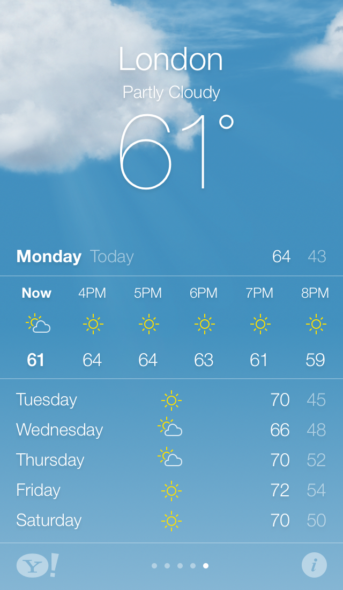 | **Take advantage of the whole screen.**  Reconsider the use of insets and visual frames and—instead—let the content extend to the edges of the screen. Weather is a great example of this approach: The beautiful, full-screen depiction of the current weather instantly conveys the most important information, with room to spare for hourly data.  
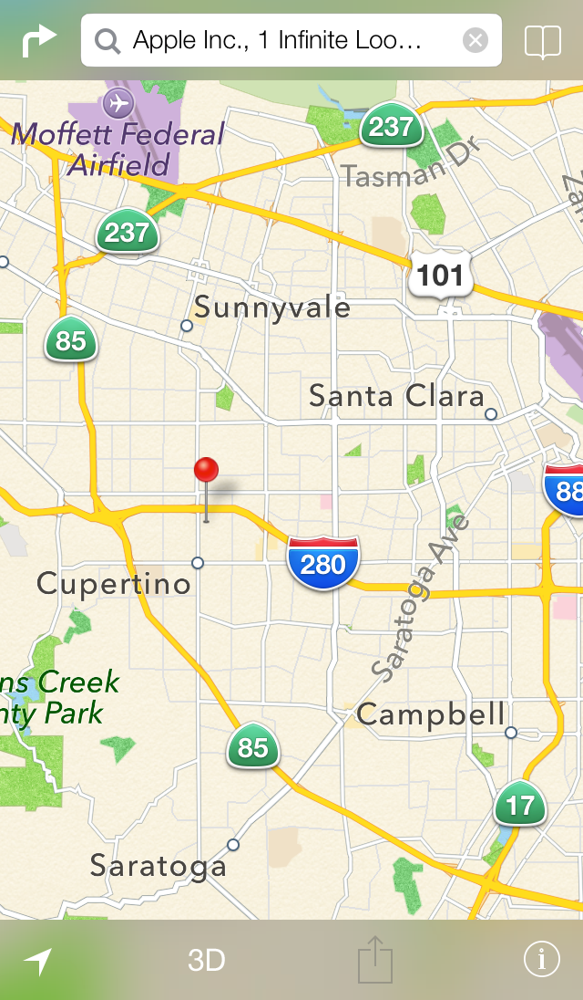 | **Reconsider visual indicators of physicality and realism.** Bezels, gradients, and drop shadows sometimes lead to heavier UI elements that can overpower the content. Instead, focus on the content and let the UI play a supporting role.
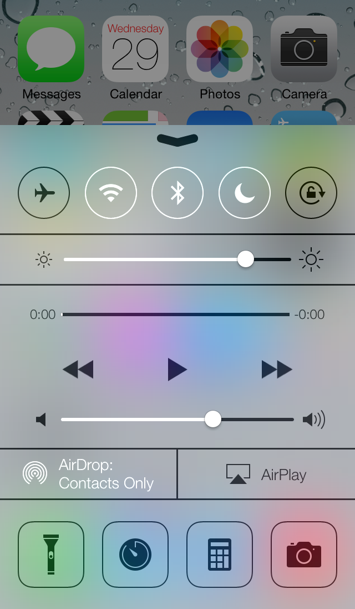| **Let translucent UI elements hint at the content behind them.** Translucency can provide context and help users see that more content is available. 

### <a id="Provide Clarity">Provide Clarity</a>

Providing clarity is another way to ensure that content is paramount in your app. Here are some ways to make the most important content and functionality clear and easy to interact with.

 | 
:-----------:  | :-----------: 
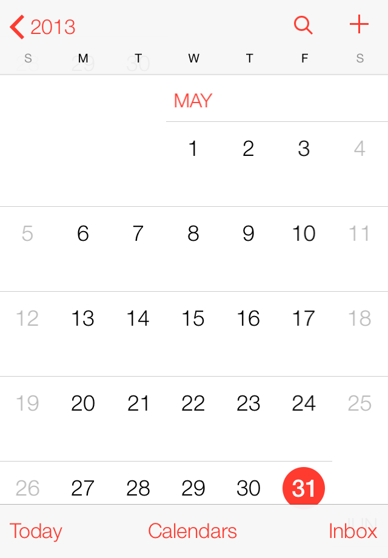 | **Use plenty of white space.** White space makes important content and functionality more noticeable. Also, white space can impart a sense of calm and tranquility, and it can make an app look more focused and efficient.
 | **Let color simplify the UI.** A key color—such as yellow in Notes—highlights important state and subtly indicates interactivity. It also gives an app a consistent visual theme.
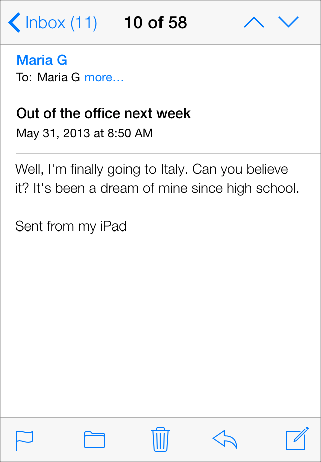 | **Ensure legibility by using the system fonts.** iOS 7 system fonts automatically adjust letter spacing and line height so that text is easy to read and looks great at every size the user chooses.
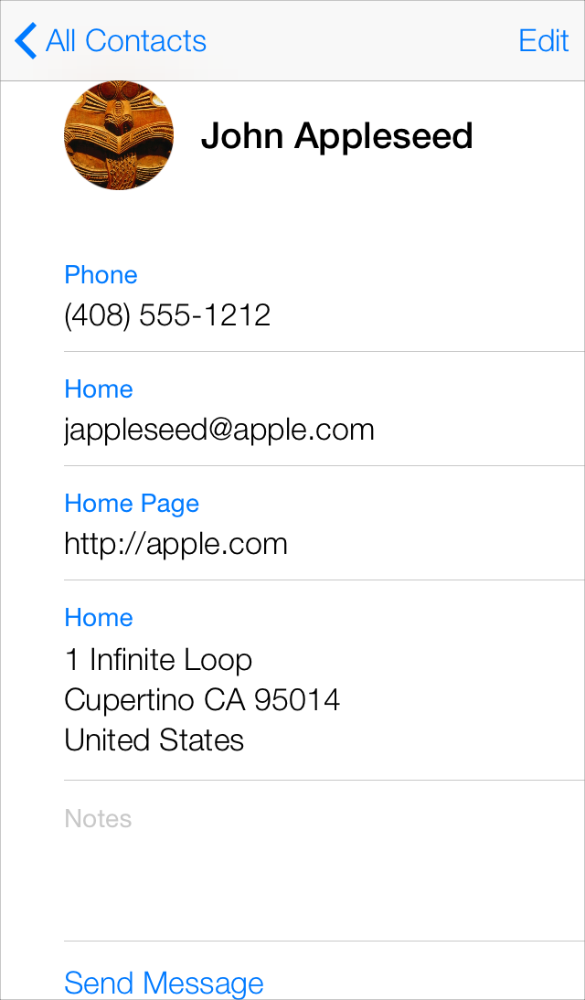 | **Embrace borderless buttons.** Instead of relying on a bezel to indicate interactivity, craft meaningful button titles and use a key or system color to show users that elements are interactive. The contact view uses the system blue color to show users that most onscreen items respond to interaction.

### <a id="Use Depth to Communicate">Use Depth to Communicate</a>

iOS 7 often displays content in distinct layers that convey hierarchy and position, and that help users understand the relationships among onscreen objects.

 | 
:-----------:  | :-----------: 
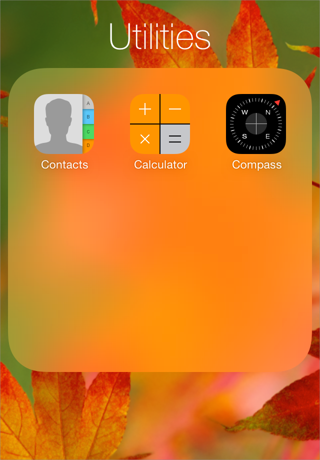 | By using a translucent background and appearing to float above the Home screen, folders separate their content from the rest of the screen.
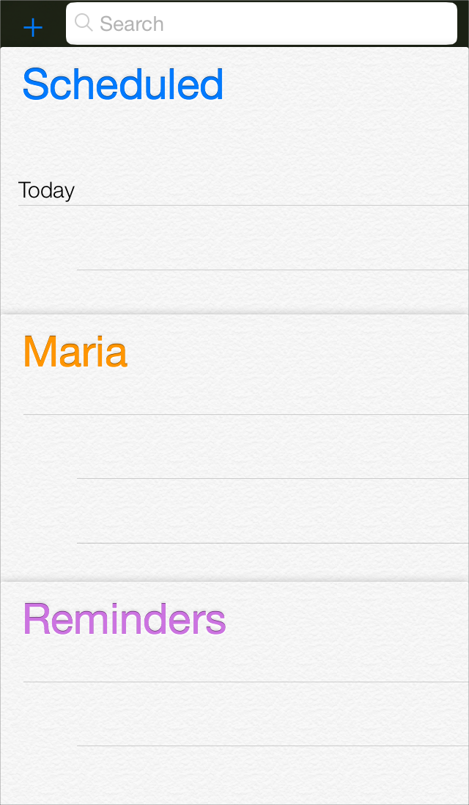 | While users work with one item in Reminders, additional items are displayed in layers at the bottom of the screen. To view all items—as shown here—users expand the layers.
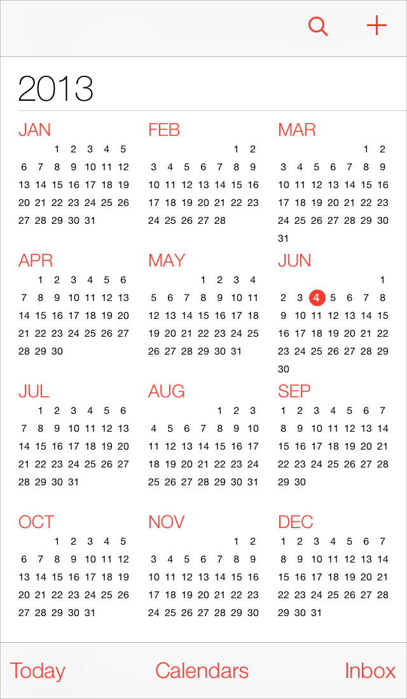 | Calendar uses enhanced transitions to give users a sense of depth as they move between viewing years, months, and days. In the scrolling year view shown here, users can instantly see today’s date and perform other calendar tasks.
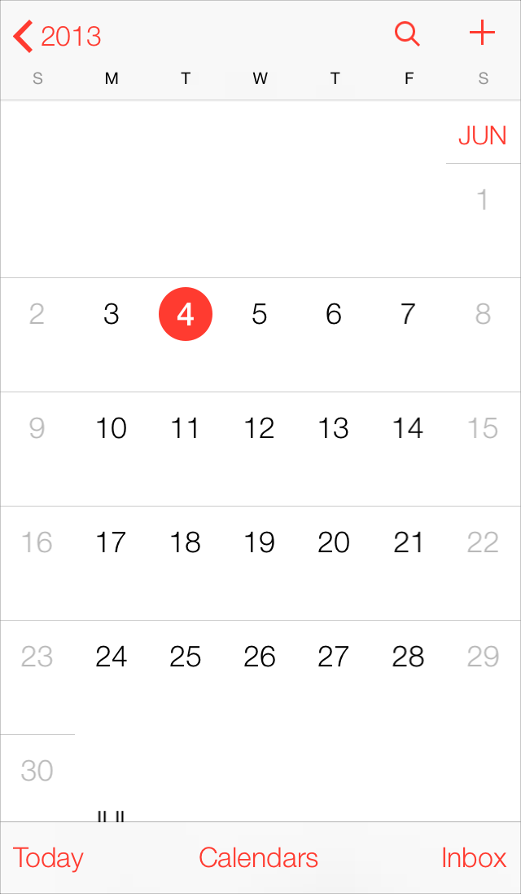 | When users select a month, the year view appears to zoom out and the month view is revealed behind it.
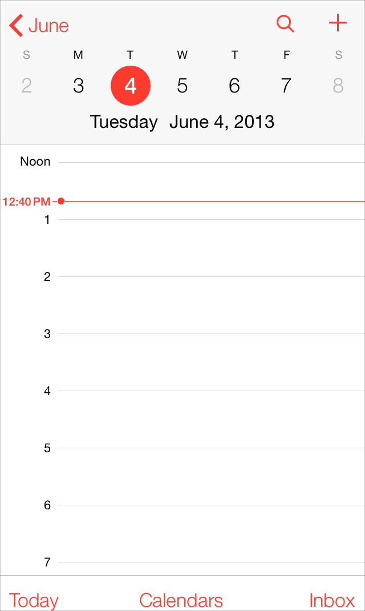 | A similar transition happens when users select a day: The month view expands outward, revealing the day view.

[iOS App Anatomy >]()