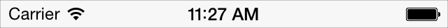
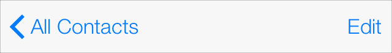
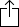
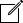
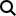
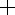
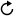
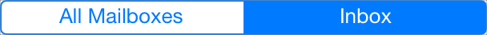

###Bars

#### 状态栏(The Status Bar)
状态栏用来展示设备以及当前环境的重要信息。

默认状态栏 | 浅色内容状态栏
:-----------:  | :-----------: 
  | 

你可以为整个应用全局设置状态栏的样式也可以为每个View Controller单独设置。想获取更多信息，请查阅[UIApplication Class Reference](https://developer.apple.com/library/prerelease/ios/documentation/UIKit/Reference/UIApplication_Class/Reference/Reference.html#//apple_ref/doc/uid/TP40006728)来了解 *UIStatusBarStyle* 常量以及查阅[UIViewController Class Reference](https://developer.apple.com/library/prerelease/ios/documentation/UIKit/Reference/UIViewController_Class/Reference/Reference.html#//apple_ref/doc/uid/TP40006926)来了解 *preferredStatusBarStyle* 属性。

##### 外观和行为(Appearance and Behavior)

状态栏是透明的。无论设备在哪种朝向状态下，状态栏都会在屏幕的顶端出现并展示了用户需要的信息，比如网络状况，日期以及电量。

##### 指导(Guidelines)

尽管状态栏并不像其它控件一样使用频繁，但是明白它在你的应用中的作用也是非常重要的。

* **轻易不要隐藏状态栏。** 因为状态栏是透明的，所以通常没有必要隐藏它。一旦它被隐藏意味着用户如果要看时间或者查看Wi-Fi状态必须跳出你的应用。

* **如果用户在全屏观看视频或浏览其它多媒体时应该隐藏状态栏和其它所有控件。** 如果选择如此，需要保证用户能够通过轻点屏幕来呼出状态栏或者相应的控件。除非有特殊情况，应尽量避免重新定义其它手势来达到此目的，因为用户很难发现并记住它。

* **不要创建自定义的状态栏。** 用户依赖系统提供的状态栏的一致性。尽管你可能在应用中隐藏它，但是创建自定义的状态栏是不被推荐的。

* **给状态栏设置一个适合你应用的内容颜色。** 默认显示黑色内容的状态栏和浅色内容的应用比较搭配。而浅色内容的则比较适合深色内容的应用。

* **尽可能不要在状态栏上放置无用的内容。** 特别是，不要试图让用户通过点击状态栏获取内容或者激活应用的控件。

* **在适当的情况下显示网络活动指示器。** 网络活动指示器可以告诉用户漫长的网络访问正在进行中。想了解如何实现，请查阅[Network Activity Indicator](https://developer.apple.com/library/prerelease/ios/documentation/UserExperience/Conceptual/MobileHIG/Controls.html#//apple_ref/doc/uid/TP40006556-CH15-SW44)。

#### 导航栏(Navigation Bar)
导航栏通过信息层级来实现导航，也可用做内容管理。

导航栏属于一个Navigation Controller, 一个用来负责展示不同层级关系的多个View的编程对象。想知道如何定义导航栏可以查阅[Navigation Controllers](https://developer.apple.com/library/prerelease/ios/documentation/WindowsViews/Conceptual/ViewControllerCatalog/Chapters/NavigationControllers.html#//apple_ref/doc/uid/TP40011313-CH2)以及[Navigation Bars](https://developer.apple.com/library/prerelease/ios/documentation/UserExperience/Conceptual/UIKitUICatalog/UINavigationBar.html#//apple_ref/doc/uid/TP40012857-UINavigationBar)。

##### 外观和行为
导航栏通常也出现在屏幕的顶端，在状态栏的下面。它可以居中显示当前界面或者View的标题。当在多级信息浏览时，用户可以通过点击返回按钮或者从屏幕的边缘开始横向滑动来返回上一级界面。另外，用户可以点击导航栏里一些跟内容相关的控件来操控屏幕中显示的内容。

导航栏是透明的并且里面的控件也是无框的。

在iPhone里，导航栏的宽度永远都是填充满屏幕的，在旋转设备的时候它的高度会自动进行适配。

##### 指导
你可以通过导航栏在不同的View之间进行切换，或者提供控件来管理View中的元素。

**如果有用的话，使用当前View的标题作为导航栏的标题。** 如果标题让导航栏显得多余的话就让标题空着吧。

当用户来到了一个新的场景，通常应该做两件事:

* 如果需要标题的话，标题应该变成当前层级的。在标题的左边应该出现一个返回按钮，并且它被标记为上一个层级的标题。
保证导航栏的文字容易识别。使用系统字体会保证最大的可读性，如果必要的话你也可以使用不同的字体。

* 在应用的顶级考虑是否应当在导航栏放置一个Segmented Control。这对帮助你压缩信息层级并让用户更容易找到他们想要的东西特别有用。如果在导航栏使用了Segmented Control一定要恰当地选择返回按钮的标题。(查看使用指南，见 [Segmented Control](https://developer.apple.com/library/prerelease/ios/documentation/UserExperience/Conceptual/MobileHIG/Controls.html#//apple_ref/doc/uid/TP40006556-CH15-SW27)。)

**避免在导航栏放置过多的控件，即使在空间还很充足的情况下。** 导航栏应该只包含标题，返回按钮以及管理内容的控件。如果你使用了Segmented Control，那么就不能显示标题并且不能添加Segmented Control以外的的其它控件了。 

**根据相应的环境使用系统提供的按钮。** 获取相关信息，查阅[Toolbar and Navigation Bar Buttons](https://developer.apple.com/library/prerelease/ios/documentation/UserExperience/Conceptual/MobileHIG/Bars.html#//apple_ref/doc/uid/TP40006556-CH12-SW33)。如果你决定创建自己的导航栏控件，参考[Bar Button Icons](https://developer.apple.com/library/prerelease/ios/documentation/UserExperience/Conceptual/MobileHIG/BarIcons.html#//apple_ref/doc/uid/TP40006556-CH21-SW1)如何进行设计。

**如果可以的话，定制属于你应用的导航栏。** 比如，你可以提供一个任意的背景图或者可以调整透明度的填充色。在某些情况下，提供一个拉伸的背景图会比较好；了解如何创建可拉伸的图片，查阅[Creating Resizable Images](https://developer.apple.com/library/prerelease/ios/documentation/UserExperience/Conceptual/MobileHIG/ResizableImages.html#//apple_ref/doc/uid/TP40006556-CH30-SW1)。当你设计iOS 7的应用中背景图的时候应该注意正确的高度；更多的信息查阅[iOS 7 UI Transition Guide](https://developer.apple.com/library/prerelease/ios/documentation/UserExperience/Conceptual/TransitionGuide/index.html#//apple_ref/doc/uid/TP40013174)里的[Navigation Bar](https://developer.apple.com/library/prerelease/ios/documentation/UserExperience/Conceptual/TransitionGuide/Bars.html#//apple_ref/doc/uid/TP40013174-CH8-SW3) 。

**保证你定制的导航栏在风格上和你的应用保持一致。** 比如，不要将一个不透明的导航栏和一个透明的工具栏揉到一起。同样，最好避免在设备保持方向的情况下，在不同界面却让导航栏的背景图，颜色或者透明度产生差异。

**保证定制的返回按钮不会产生歧义。** 用户明白标准的返回按钮能让他们在信息层级中原路返回。如果你决定使用自定义的图片，一定要连遮罩图片一起提供。因为iOS 7 使用这个遮罩来实现场景切换时按钮文字的显示和隐藏。

**在iPhone里，应该为设备旋转时导航栏高度的变化进行准备。** 特别是，一定要让你自定义的导航栏图标在横屏状态下也十分合适。不要用代码来声明导航栏的高度，取而代之的应该是充分利用[UIBarMetrics](https://developer.apple.com/library/prerelease/ios/documentation/UIKit/Reference/UIBarPositioning_Protocol/Reference/Reference.html#//apple_ref/c/tdef/UIBarMetrics)的常量来让内容填充完美。

#### 工具栏(Toolbar)
工具栏收纳了能响应屏幕或者View上对象相关动作的控件。

A toolbar is typically contained in a navigation controller, which is an object that manages the display of a hierarchy of custom views. To learn more about defining a toolbar in your code, see “Displaying a Navigation Toolbar” in View Controller Catalog for iOS and “Toolbar”.

###### 外观和行为
On iPhone, a toolbar always appears at the bottom edge of a screen or view, but on iPad it can instead appear at the top edge.

A toolbar is translucent and its items are displayed equally spaced across its width. The precise set of toolbar items can change from view to view, because the items are always specific to the context of the current view.

On iPhone, changing the device orientation from portrait to landscape can change the height of the toolbar automatically.

##### 指导
Use a toolbar to provide a set of actions users can take in the current context.

Use a toolbar to give people a selection of frequently used commands that make sense in the current context. An alternative is to put a segmented control in a toolbar to give people access to different perspectives on your app’s data or to different app modes (for usage guidelines, see Segmented Control).

Maintain a hit target area of at least 44 x 44 points for each toolbar item. If you crowd toolbar items too closely together, it’s hard for people to tap the one they want.

Use system-provided toolbar items according to their documented meaning. See Toolbar and Navigation Bar Buttons for more information. If you decide to create your own toolbar items, see Bar Button Icons for advice on how to design them.

On iPhone, be prepared for the change in toolbar height that occurs on device rotation. In particular, make sure your custom toolbar icons fit well in the thinner bar that appears in landscape orientation. Don’t specify the height of a toolbar programmatically; instead, you can take advantage of the UIBarMetrics constants to ensure that your content fits well.

#### 工具栏和导航栏的按钮(Toolbar and Navigation Bar Buttons)
iOS makes available many of the standard buttons users see in toolbars and navigation bars.

As with all system-provided buttons, you should avoid using the buttons described in “Standard buttons available for toolbars and navigation bars (plain style)” to represent actions other than those for which they are designed. In particular, avoid choosing a button based on its appearance, without regard for its documented meaning.

To find out which symbol names to use to specify these buttons, see the documentation for UIBarButtonSystemItem in UIBarButtonItem Class Reference.

**Table 33-1Standard** buttons available for toolbars and navigation bars

按钮 | 名称 | 含义
:-----------:  | :----------- |  :-----------
 | 分享 | Open an action sheet that lists system-provided and app-specific services that act on the specified content   
 | 相机 | Open an action sheet that displays a photo picker in camera mode   
 | AirPlay | Open an action sheet that displays nearby AirPlay enabled devices.  
 | 定位 | Use Location Services to display the user’s current location   
 | 编辑 | Open a new message view in edit mode   
 | 书签 | Show app-specific bookmarks   
 | 搜索 | Display a search field   
 | 添加 | Create a new item   
 | 删除 | Delete current item   
 | 组织 | Move or route an item to a destination within the app, such as a folder   
 | 回复 | Send or route an item to another location   
 | 刷新 | Refresh contents (use only when necessary; otherwise, refresh automatically)   

In addition to the buttons shown in “Standard buttons available for toolbars and navigation bars (plain style)”, you can also use the system-provided Edit, Cancel, Save, Done, Redo, and Undo buttons to support editing or other types of content manipulation in your app. The appearance of each of these buttons is provided by its text title. To find out which symbol names to use to specify these buttons, see the documentation for UIBarButtonSystemItem in UIBarButtonItem Class Reference.

In addition, you can use the system-provided Info button in a toolbar: 

#### 标签栏(Tab Bar)
A tab bar gives people the ability to switch between different subtasks, views, or modes.

A tab bar is contained in a tab bar controller, which is an object that manages the display of a set of custom views. To learn more about defining a tab bar in your code, see “Tab Bar Controllers” and “Tab Bars”.
##### 外观和行为
A tab bar appears at the bottom edge of the screen and should be accessible from every location in the app. A tab bar is translucent and it displays icons and text in tabs, all of which are equal in width. When users select a tab, the icon receives the appropriate tint color.

On iPhone, a tab bar can display no more than five tabs at one time; if the app has more tabs, the tab bar displays four of them and adds the More tab, which reveals the additional tabs in a list. On iPad, a tab bar can display more than five tabs.

A tab can display a badge—which is a red oval that contains white text and either a number or exclamation point—that communicates app-specific information.

A tab bar does not change its height when the device changes its orientation.

##### 指导
Use a tab bar to give users access to different perspectives on the same set of data or different subtasks related to the overall function of your app. When you use a tab bar, follow these guidelines:

Don’t use a tab bar to give users controls that act on elements in the current mode or screen. If you need to provide controls for your users, use a toolbar instead (for usage guidelines, see Toolbar).

In general, use a tab bar to organize information at the app level. A tab bar is well-suited for use in the main app view because it’s a good way to flatten your information hierarchy and provide access to several peer information categories or modes at one time.

Don’t remove a tab when its function is unavailable. If a tab represents a part of your app that is unavailable in the current context, it’s better to display a disabled tab than to remove the tab altogether. If you remove a tab in some cases but not in others, you make your app’s UI unstable and unpredictable. The best solution is to ensure that all tabs are enabled, but explain why a tab’s content is unavailable. For example, if the user doesn’t have any songs on an iOS device, the Songs tab in the Music app displays a screen that explains how to download songs.

Consider badging a tab bar icon to communicate unobtrusively. You can display a badge on a tab bar icon to indicate that there is new information associated with that view or mode.

Use system-provided tab bar icons according to their documented meaning. For more information, see Tab Bar Icons. If you decide to create your own tab bar icons, see Bar Button Icons for advice on how to design them.

If appropriate, customize the appearance of a tab bar. For example, you can supply a custom tint for the tab bar and its icons, as long as the icons are either system-provided or custom template images. You can also supply a background image for the tab bar (note that it’s often a good idea to supply a resizable background image; to learn more about creating a resizable image, see Creating Resizable Images).

On iPad, you might use a tab bar in a split view pane or a popover if the tabs switch or filter the content within that view. However, it often works better to use a segmented control at the bottom edge of a popover or split view pane, because the appearance of a segmented control coordinates better with the popover or split view appearance. (For more information on using a segmented control, see Segmented Control.)

On iPad, avoid crowding the tab bar with too many tabs. Putting too many tabs in a tab bar can make it physically difficult for people to tap the one they want. Also, with each additional tab you display, you increase the complexity of your app. In general, try to limit the number of tabs in the main view or in the right pane of a split view to about seven. In a popover or in the left pane of a split view, up to about five tabs fit well.

On iPad, avoid creating a More tab. In an iPad app, a screen devoted solely to a list of additional tabs is a poor use of space.

On iPad, display the same tabs in each orientation to increase the visual stability of your app. In portrait, the recommended seven tabs fit well across the width of the screen. In landscape orientation, you should center the same tabs along the width of the screen. This guidance also applies to the usage of a tab bar within a split view pane or a popover. For example, if you use a tab bar in a popover in portrait, it works well to display the same tabs in the left pane of a split view in landscape.

#### 标签栏图标(Tab Bar Icons)
iOS provides the standard icons described in Table 33-2 for use in tab bars.

To find out which symbol names to use to specify these icons, see the documentation for UITabBarSystemItem in UITabBarItem Class Reference.

**Table 33-2Standard** icons for use in the tabs of a tab bar

图标 | 名称 | 含义
:-----------:  | :----------- |  :-----------
 | 书签 | Show app-specific bookmarks
 | 联系人 | Show contacts
 | 下载 | Show downloads
 | 收藏 | Show user-determined favorites
 | 推荐 | Show content featured by the app
 | 历史 | Show history of user actions
 | 更多 | Show additional tab bar items
 | 最近 | Show the most recent item
 | 常用 | Show items most popular with all users
 | 最近 | Show the items accessed by the user within an app-defined period
 | 搜索 | Enter a search mode
 | 榜首 | Show the highest-rated items, as determined by the user

As with all standard buttons and icons, it’s essential to use the tab bar icons in accordance with their documented meanings. In particular, take care to base your usage of an icon on its semantic meaning, not its appearance. This will help your app’s UI make sense even if the icon associated with a specific meaning changes its appearance.

#### 搜索栏(Search Bar)
A search bar accepts text from users, which can be used as input for a search (shown here with placeholder text).

To learn how to define a search bar in your code, see “Search Bars”.

##### 外观和行为
A search bar looks similar to a text field. By default, a search bar displays the search icon on the left side. When the user taps a search bar, a keyboard appears; when the user is finished typing search terms, the input is handled in an app-specific way.

In addition, a search bar can display a few optional elements, such as:

* **Placeholder** text. This text might state the function of the control—for example, “Search”—or remind users in what context they are searching—for example, “Google”.
The **Bookmarks** button. This button can provide a shortcut to information users want to easily find again. For example, the Bookmarks button in the Maps search mode gives access to bookmarked locations, recent searches, and contacts.
* The Bookmarks button is visible only when there is no user-supplied or nonplaceholder text in the search bar. When the search bar contains such text, the Clear button appears so that users can erase the text.
* The **Clear** button. Most search bars include a Clear button that lets users to erase the contents of the search bar with one tap.
When the search bar contains any nonplaceholder text, the Clear button is visible so users can erase the text. If there is no user-supplied or nonplaceholder text in the search bar, the Clear button is hidden.
* The **results list** icon. This icon indicates the presence of search results. When users tap the results list icon, an app can display the results of their most recent search.
A descriptive title, called a prompt, that appears above the search bar. For example, a prompt can be a short phrase that provides introductory or app-specific context for the search bar.

##### 指导
Use a search bar to enable search in your app. Don’t use a text field to enable search because it doesn’t have the standard search-bar appearance that users expect.

You can customize a search bar by tinting it or specifying a custom background appearance and by providing custom accessory images. In iOS 7, you can put a search bar in a navigation bar (for more information, see UISearchDisplayController).

If you decide to supply a background image, it can be a good idea to supply a resizable image; to learn more about creating one, see Creating Resizable Images.

#### 分区栏(Scope Bar)
A scope bar—which is available only in conjunction with a search bar—allows users to define the scope of a search (shown here below a search bar).

To learn more about defining a search bar and scope bar in your code, see “Search Bars”.

##### 外观和行为
When a search bar is present, a scope bar can appear near it. Regardless of orientation, a scope bar displays below a search bar, unless you use a search display controller in your code (for more information on the way this works, see UISearchDisplayController Class Reference). When you use a search display controller, the scope bar is displayed within the search bar to the right of the search field when the device is in landscape orientation and below the search bar when the device is in portrait.

##### 指导
It can be useful to display a scope bar when there are clearly defined or typical categories in which users might want to search. For example, users often want to narrow their search to one field in an email message.

You can customize a scope bar by supplying a background image. In addition, you can define different appearances for the enabled and disabled states of the scope bar buttons and the dividers between them.